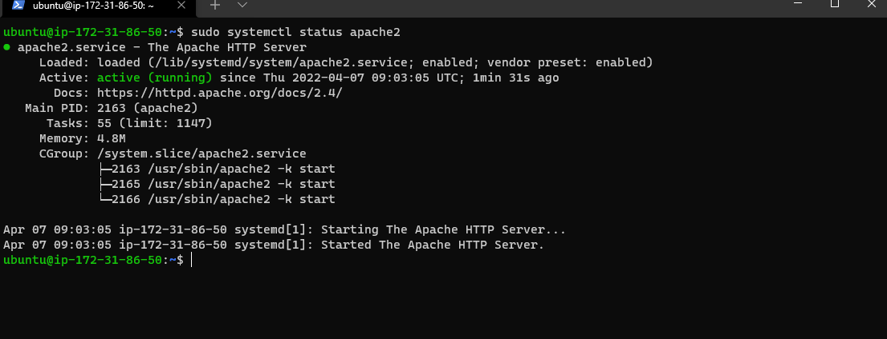
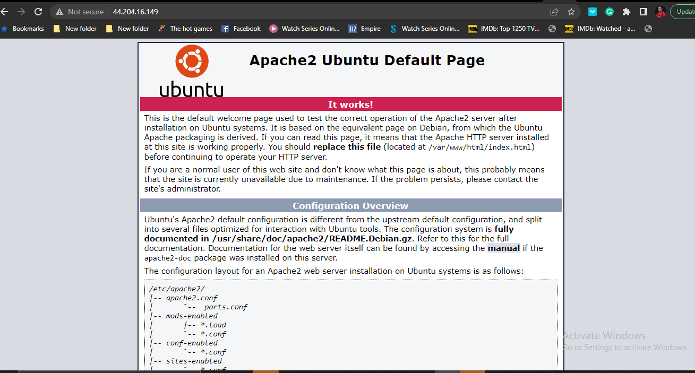
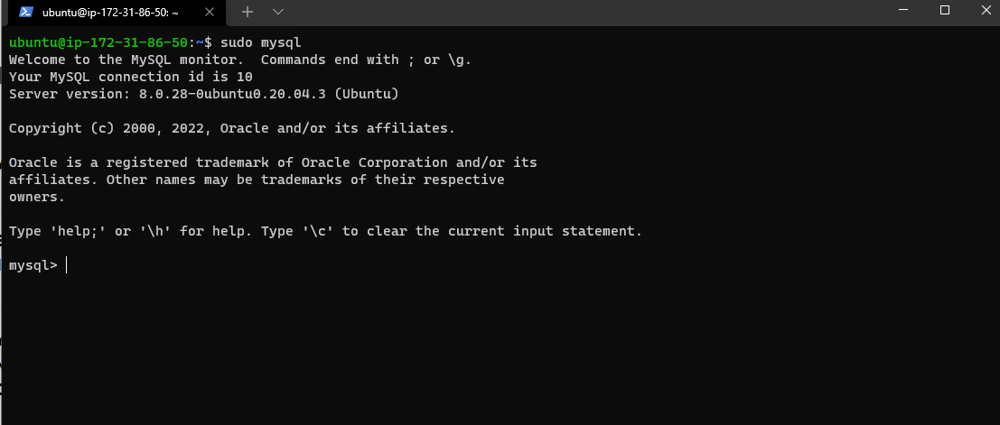
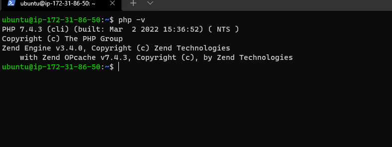
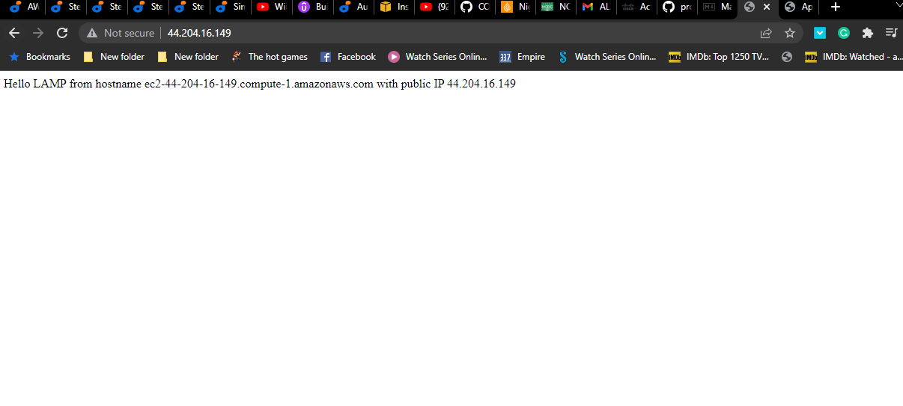
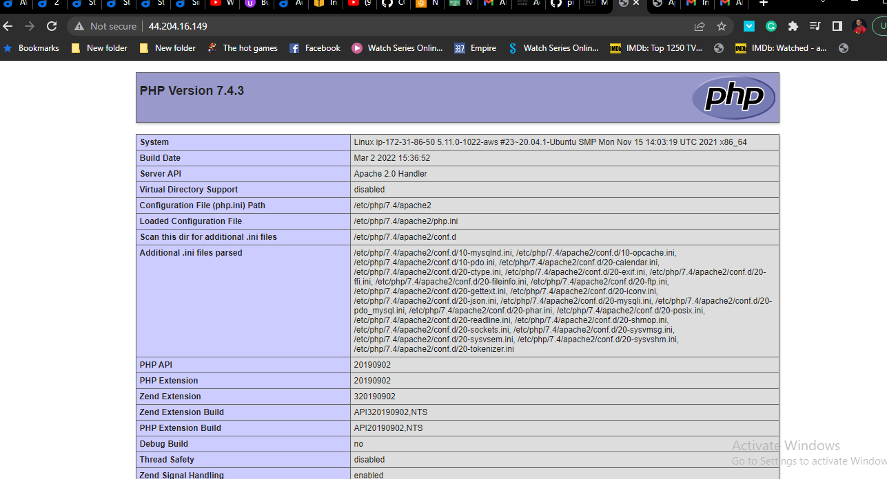

## LAMP stack Implementation
STEP 1 — INSTALLING APACHE AND UPDATING THE FIREWALL 

Apache HTTP Server is a web server software mostly used .
In order to install apache we must update all the packages using this code 

`sudo apt update`  

and the install apache with

`sudo apt install apache2`

then check the check the status

`sudo systemctl status apache2`



checking the apache landing page on my browser




STEP 2 — INSTALLING MYSQL

 Installing MYSQL using the code below 

`sudo apt install mysql-server`

For secure installation use the code below

`sudo mysql_secure_installation`

mysql successfully installed




STEP 3 — INSTALLING PHP

To install these 3 packages of  php, php plus and php plus sql at once, run:

`sudo apt install php libapache2-mod-php php-mysql`

Php successfully installed



At this point our LAMP is successfully installed

L-Linux (ubuntu)  
A-Apache HTTP Server  
M-Mysql  
P-Php


STEP 4 — CREATING A VIRTUAL HOST FOR YOUR WEBSITE USING APACHE

First of all create a directory projectlamp

`sudo mkdir var/www/projectlamp`

Next, assign ownership of the directory with your current system user:

 `sudo chown -R $USER:$USER /var/www/projectlamp`

 open a file with this code 

`sudo vi /etc/apache2/sites-available/projectlamp.conf`

Then post the code below 

```
<VirtualHost *:80>
    ServerName projectlamp
    ServerAlias www.projectlamp 
    ServerAdmin webmaster@localhost
    DocumentRoot /var/www/projectlamp
    ErrorLog ${APACHE_LOG_DIR}/error.log
    CustomLog ${APACHE_LOG_DIR}/access.log combined
</VirtualHost> 
```

Enable the virtualhost with the code below

`sudo a2ensite projectlamp`

Disable the default website that comes installed with Apache with the code below

`sudo a2dissite 000-default`

Making sure your configuration file doesn’t contain syntax errors, run:

`sudo apache2ctl configtest`

Reload the web server  to effect the changes 

`sudo systemctl reload apache2`

Create an index.html file in that location so that we can test that the virtual host works as expected:
```
sudo echo 'Hello LAMP from hostname' $(curl -s http://169.254.169.254/latest/meta-data/public-hostname) 'with public IP' $(curl -s http://169.254.169.254/latest/meta-data/public-ipv4) > /var/www/projectlamp/index.html
```




STEP 5 — ENABLE PHP ON THE WEBSITE


`sudo vim /etc/apache2/mods-enabled/dir.conf`

```
<IfModule mod_dir.c>
        #Change this:
        #DirectoryIndex index.html index.cgi index.pl index.php index.xhtml index.htm
        #To this:
        DirectoryIndex index.php index.html index.cgi index.pl index.xhtml index.htm
</IfModule>
```
Then reload apache  `sudo systemctl reload apache2`

Create a new file named index.php inside your custom web root folder:

`vim /var/www/projectlamp/index.php`

insert this simple php codes
```
<?php
phpinfo();
```


## THE END


